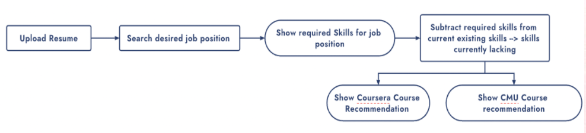

## Context

We aim at helping students to improve their job search experience and success by tailoring customized course recommendations based on desired job title and current skill sets in an increasingly competitive market.

## Method

Web Scraping using Python, Selenium and BeautifulSoup to build an initial software that can recommend to users courses to pick in CMU and Massive Open Online Courses (MOOCs) based on the skills required by the desired job and that are currently lacking from resume.


## Product Feature
- Scans resume to find skills already possessed
- Takes desired job input from user
- Recommend open jobs posted online that match your career goals.
- Recommends courses listed in CMU and other MOOCs platforms to learn your skills required for your dream job.

## Product Flowchart



## GUI


## Results


** This project's repository can be found on my [github](https://github.com/lilyportfolio/Web-Scraping-using-Python) **

```{r setup, include=FALSE}
knitr::opts_chunk$set(collapse = TRUE)
```